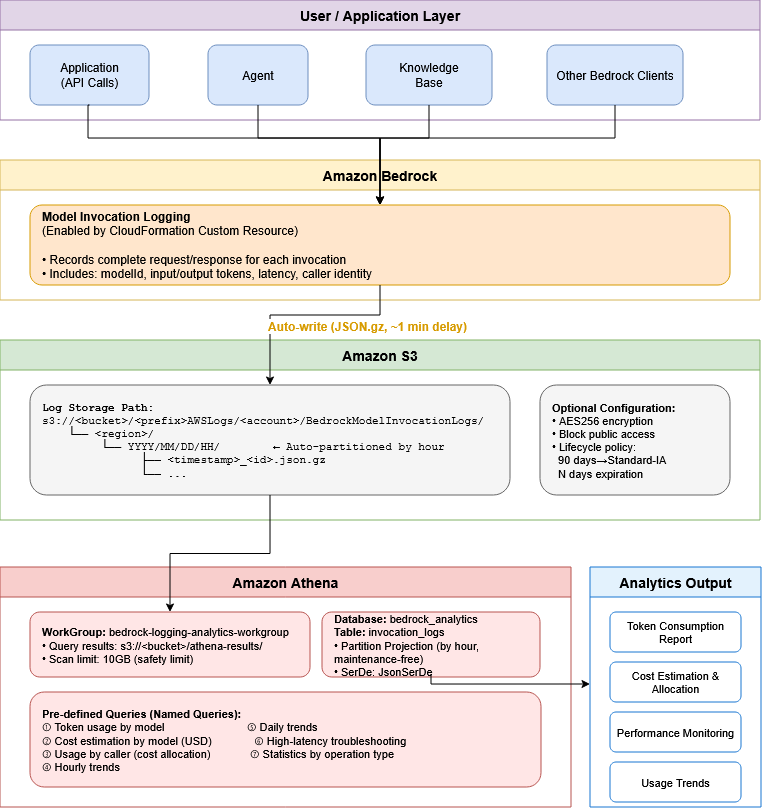

# [IaC] Bedrock Logging & Analytics

English | [中文](docs/README_CN.md)

One-click solution to enable Amazon Bedrock invocation logging and analyze token usage & costs with Amazon Athena.

## Architecture

```
Bedrock API Call → Invocation Logging → S3 (JSON.gz) → Athena (SQL Query)
```



**Deployed Resources:**
- AWS Lambda (Custom Resource) — Configures Bedrock invocation logging
- IAM Role — Lambda execution role with Bedrock logging permissions
- Athena WorkGroup — Dedicated workgroup with query result location and 10GB scan limit
- Athena Named Queries — Pre-built analytics queries (7 templates)
- S3 Bucket (optional) — With AES256 encryption, public access block, and lifecycle policy

## Deploy

| Region | Launch |
|--------|--------|
| us-west-2 (Oregon) | [](https://us-west-2.console.aws.amazon.com/cloudformation/home?region=us-west-2#/stacks/create/review?stackName=bedrock-logging-analytics&templateURL=https://raw.githubusercontent.com/aleck31/bedrock-logging-analytics/main/cf-deploy-template.yaml) |
| us-east-1 (N. Virginia) | [](https://us-east-1.console.aws.amazon.com/cloudformation/home?region=us-east-1#/stacks/create/review?stackName=bedrock-logging-analytics&templateURL=https://raw.githubusercontent.com/aleck31/bedrock-logging-analytics/main/cf-deploy-template.yaml) |

## Parameters

| Parameter | Default | Description |
|-----------|---------|-------------|
| UseExistingBucket | No | `Yes` to use an existing S3 bucket, `No` to create a new one |
| ExistingBucketName | — | Required if UseExistingBucket=Yes. Bucket must allow Bedrock `s3:PutObject` |
| LogPrefix | `bedrock/invocation-logs/` | S3 key prefix for invocation logs |
| LogRetentionDays | 365 | Log expiration in days (new bucket only) |
| AthenaDbName | `bedrock_analytics` | Athena database name |

## Post-Deployment Setup

1. Open the **Athena console** and select the workgroup `bedrock-logging-analytics-workgroup`
2. Go to **Saved queries** tab
3. Run `bedrock-logging-analytics-create-database` first
4. Run `bedrock-logging-analytics-create-table` to create the partitioned table
5. Start using the pre-built analytics queries

## Pre-built Queries

| Query | Description |
|-------|-------------|
| token-usage-by-model | Token consumption and avg latency per model (last 7 days) |
| estimated-cost-by-model | Estimated USD cost per model (last 30 days) |
| usage-by-caller | Token usage by IAM user/role for cost allocation |
| hourly-trend | Hourly invocation and token trend (last 24 hours) |
| daily-trend | Daily invocation and token trend (last 30 days) |
| high-latency-calls | Calls with latency > 5 seconds (last 7 days) |

## Usage

### Athena Console

1. Open [Athena Console](https://console.aws.amazon.com/athena/home)
2. Select workgroup `bedrock-logging-analytics-workgroup` from the top dropdown
3. Go to **Saved queries** tab → click any pre-built query → **Run**
4. Or write custom queries in the **Editor** tab against `bedrock_analytics.invocation_logs`

### AWS CLI

```bash
# Run a query
QUERY_ID=$(aws athena start-query-execution \
  --query-string "SELECT modelId, count(*) as cnt, sum(input.inputTokenCount) as input_tokens, sum(output.outputTokenCount) as output_tokens FROM invocation_logs WHERE datehour >= date_format(date_add('day', -7, now()), '%Y/%m/%d/%H') GROUP BY modelId ORDER BY cnt DESC" \
  --query-execution-context Database=bedrock_analytics \
  --work-group bedrock-logging-analytics-workgroup \
  --region us-west-2 \
  --query 'QueryExecutionId' --output text)

# Wait for completion
aws athena get-query-execution --query-execution-id $QUERY_ID \
  --region us-west-2 --query 'QueryExecution.Status.State' --output text

# Get results
aws athena get-query-results --query-execution-id $QUERY_ID \
  --region us-west-2 --output table
```

### Python (boto3)

```python
import boto3, time

athena = boto3.client('athena', region_name='us-west-2')

resp = athena.start_query_execution(
    QueryString="""
        SELECT modelId, count(*) as invocations,
               sum(input.inputTokenCount) as input_tokens,
               sum(output.outputTokenCount) as output_tokens
        FROM invocation_logs
        WHERE datehour >= date_format(date_add('day', -7, now()), '%Y/%m/%d/%H')
        GROUP BY modelId
    """,
    QueryExecutionContext={'Database': 'bedrock_analytics'},
    WorkGroup='bedrock-logging-analytics-workgroup'
)

query_id = resp['QueryExecutionId']

# Wait for completion
while True:
    status = athena.get_query_execution(QueryExecutionId=query_id)
    state = status['QueryExecution']['Status']['State']
    if state in ('SUCCEEDED', 'FAILED', 'CANCELLED'):
        break
    time.sleep(1)

# Get results
results = athena.get_query_results(QueryExecutionId=query_id)
for row in results['ResultSet']['Rows']:
    print([col.get('VarCharValue', '') for col in row['Data']])
```

### Custom Query Tips

Always include `datehour` partition filter to minimize Athena scan costs:

```sql
-- Last 24 hours
WHERE datehour >= date_format(date_add('day', -1, now()), '%Y/%m/%d/%H')

-- Specific date
WHERE datehour >= '2026/03/17/00' AND datehour <= '2026/03/17/23'

-- Last 7 days
WHERE datehour >= date_format(date_add('day', -7, now()), '%Y/%m/%d/%H')
```

## Web UI (Optional)

A Streamlit dashboard for visualizing Bedrock usage and costs.


### Quick Start

```bash
cd webui
uv sync
uv run streamlit run app.py
```

Open http://localhost:8501 in your browser.

### Features

- Summary cards: total invocations, input/output tokens, estimated cost
- Token usage & cost charts by model
- Token usage & cost charts by caller (IAM user/role)
- Daily and hourly trends
- Latency analysis (min/avg/max) with high latency call detection

### Configuration

Use the sidebar to configure:
- AWS Profile
- Region
- Athena Workgroup name
- Athena Database name
- Time range (1 day / 7 days / 30 days / 90 days)

## CLI Deployment

```bash
# Create new bucket
aws cloudformation create-stack \
  --stack-name bedrock-logging-analytics \
  --template-body file://cf-deploy-template.yaml \
  --parameters ParameterKey=UseExistingBucket,ParameterValue=No \
  --capabilities CAPABILITY_IAM \
  --region us-west-2

# Use existing bucket
aws cloudformation create-stack \
  --stack-name bedrock-logging-analytics \
  --template-body file://cf-deploy-template.yaml \
  --parameters ParameterKey=UseExistingBucket,ParameterValue=Yes \
               ParameterKey=ExistingBucketName,ParameterValue=YOUR_BUCKET_NAME \
  --capabilities CAPABILITY_IAM \
  --region us-west-2
```

## Cleanup

```bash
aws cloudformation delete-stack --stack-name bedrock-logging-analytics --region us-west-2
```

> Deleting the stack will disable Bedrock invocation logging. If a new S3 bucket was created, it is retained (DeletionPolicy: Retain) and must be deleted manually.

## Cost

This solution incurs minimal costs from three AWS services:

| Service | Pricing | Notes |
|---------|---------|-------|
| S3 Storage | ~$0.023/GB/month (Standard) | Logs auto-transition to Standard-IA ($0.0125/GB) after 90 days |
| Athena | $5/TB scanned | Partition projection significantly reduces scan volume |
| Lambda | $0.20 per 1M requests | Only invoked during stack create/update/delete |

**Monthly cost estimate** (assuming ~1KB avg compressed log per invocation):

| Monthly Invocations | S3 Storage | Athena (10 queries/day) | Estimated Total |
|--------------------:|----------:|------------------------:|----------------:|
| 10,000 | < $0.01 | < $0.01 | < $0.05 |
| 100,000 | ~$0.01 | ~$0.05 | ~$0.10 |
| 1,000,000 | ~$0.10 | ~$0.50 | ~$0.70 |
| 10,000,000 | ~$1.00 | ~$5.00 | ~$7.00 |

> - S3 storage is cumulative (grows monthly until lifecycle expiration)
> - Athena cost depends on query frequency and time range filters — always use `datehour` partition filter to minimize scans
> - Actual log size varies with prompt/response length; long conversations may average 5-10KB+ per invocation
