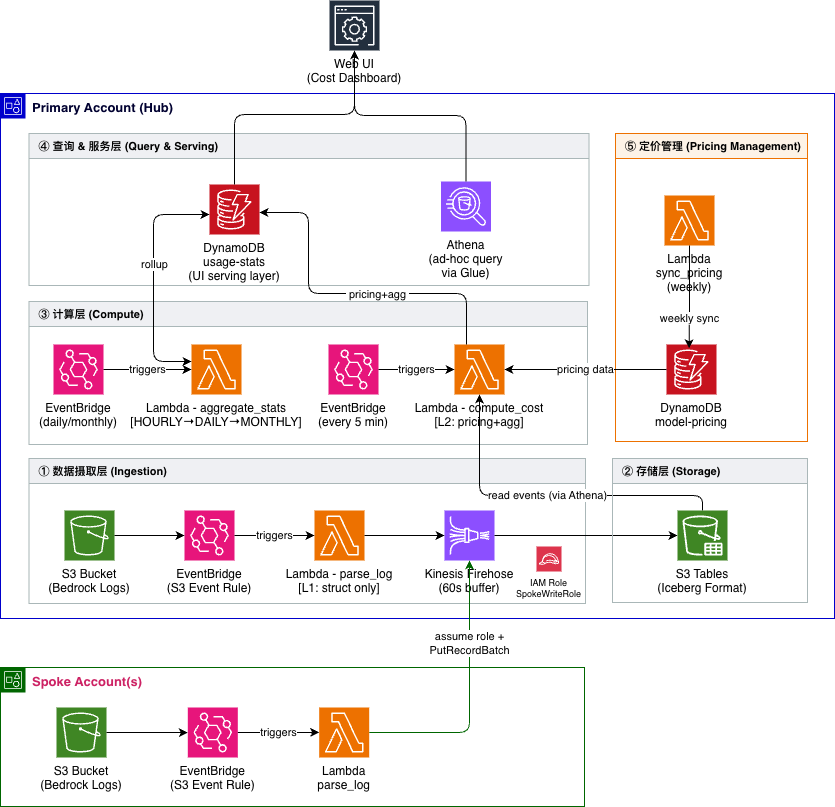

# Bedrock Invocation Analytics

English | [中文](docs/README_CN.md)

Real-time analytics for Amazon Bedrock — monitor token usage, costs, and performance across AWS accounts.

## Features
- Summary cards: invocations, input/output tokens, cache tokens, estimated cost, avg latency, avg TPOT
- Token usage & cost by model and by caller (chart / pie / table views) with per-token-type cost breakdown (input / output / cache read / cache write)
- Performance: latency by model (min/avg/max) + latency trend with model selector
- TPOT by model (min/avg/max) + TTFT trend from CloudWatch (avg/p99)
- Usage trend over time with paired model/caller filter
- "Data up to" timestamp in header — reflects actual data freshness (L2 checkpoint), not UI refresh time
- Auto refresh (10s / 30s / 1min / 5min)
- Time-aware pricing: correct historical costs even if prices change; separate 5min vs 1h prompt cache rates
- Pricing settings page: view/edit model pricing with history, weekly auto-sync from LiteLLM
- Ad-hoc Athena queries on the raw Iceberg event log for deep investigation
- Multi-account, multi-region support (sidebar selector, friendly account names from `config.yaml`)
- Login authentication (configurable via `config.yaml`)
- Responsive layout (desktop & mobile)

**Screenshot**


## Project Structure

```
├── deploy/
│   ├── cdk.json              # CDK config
│   ├── app.py                # CDK app entry (hub/spoke routing)
│   ├── hub_stack.py          # Primary account stack
│   ├── spoke_stack.py        # Spoke account stack
│   └── lambda/
│       ├── parse_log.py      # L1: S3 event → normalized JSON → Firehose
│       ├── compute_cost.py   # L2: Athena (Iceberg) → pricing → DynamoDB
│       ├── aggregate_stats.py # Rollup: HOURLY → DAILY → MONTHLY
│       ├── sync_pricing.py   # Weekly pricing sync from LiteLLM
│       └── process_log.py    # (legacy V2 path, retained for reference)
├── webui/
│   ├── main.py               # Entry point (ui.run)
│   ├── dashboard.py          # Dashboard page
│   ├── pricing.py            # Pricing settings page
│   └── data.py               # DynamoDB data access
├── scripts/
│   └── seed_pricing.py       # Seed pricing from LiteLLM
├── config.example.yaml       # Multi-account deployment config
├── deploy.sh                 # CDK deploy script (hub/spoke/all/destroy)
├── start-webui.sh            # WebUI launch script (reads .env.deploy)
└── pyproject.toml            # Dependencies (managed by uv)
```

## Architecture

Two-stage pipeline: **L1** (parse) turns every Bedrock call into a structured event in an Iceberg table; **L2** (compute) rolls those events up by pricing into DynamoDB for the dashboard to read.



<details>
<summary>ASCII version (for AI/text access)</summary>

```
┌──────────────────────────────────────────────────────────────────────────────┐
│ Primary Account (Hub)                                                        │
│                                                                              │
│  S3 logs ──→ EventBridge ──→ Lambda: parse_log ──→ Firehose ──→ S3 Tables    │
│  (Bedrock)                   [L1: structure only]  (60s buffer) (Iceberg)    │
│                                                           │                  │
│                                  ┌────────────────────────┤                  │
│                                  │                        │                  │
│                                  ▼ every 5 min            │                  │
│                    Lambda: compute_cost                   │                  │
│                    [L2: pricing + aggregation]            │                  │
│                          │                                │                  │
│                          ▼                                ▼                  │
│                    DynamoDB: usage-stats          Athena: ad-hoc query       │
│                    (serving layer for UI)         (via Glue federation)      │
│                          │                                                   │
│                          ▼                                                   │
│                         WebUI                                                │
│                                                                              │
│  DynamoDB: model-pricing ◄── Lambda: sync_pricing (weekly)                   │
│  Lambda: aggregate_stats (HOURLY → DAILY → MONTHLY, daily/monthly)           │
│  IAM Role: SpokeWriteRole (assumed by spokes to write hub Firehose)          │
└──────────────────────────────────────────────────────────────────────────────┘
       ▲ assume role + cross-account firehose:PutRecord
       │
┌──────┴───────────────────────────────────────────────────────────────────────┐
│ Spoke Account(s)                                                             │
│                                                                              │
│  S3 logs ──→ EventBridge ──→ Lambda: parse_log ──→ Hub Firehose              │
│  (Bedrock)                                                                   │
└──────────────────────────────────────────────────────────────────────────────┘
```
</details>

**How it works:**

1. **Bedrock logs** land in each account's own S3 bucket (Bedrock requires same-account/region sinks).
2. **L1 `parse_log`** (per-account Lambda, triggered by S3 events) normalizes each record into a flat JSON event (account, region, model, caller, token counts, cache split, latency, error code) and hands it to Hub's Firehose via `PutRecordBatch`. Spoke Lambdas assume a cross-account role.
3. **Firehose → S3 Tables**: Firehose buffers ~60s then upserts into the Iceberg table `bedrock_analytics.usage_events`, using `request_id` as the unique key — this is the **source of truth** for every Bedrock call, also directly queryable via Athena for ad-hoc investigation.
4. **L2 `compute_cost`** (hub only, EventBridge every 5 min) reads new events from Iceberg via Athena, looks up time-aware pricing in DynamoDB, computes cost (splitting 5m vs 1h prompt cache), and aggregates into DynamoDB via `TransactWriteItems` with a dedup guard. Separating compute from parse means fixing a pricing bug or changing aggregation logic re-runs L2 on historical events — no re-parsing raw S3.
5. **`aggregate_stats`** rolls hourly → daily → monthly on schedule. **`sync_pricing`** pulls the latest model prices from [LiteLLM](https://github.com/BerriAI/litellm) weekly.
6. **WebUI** reads DynamoDB (sub-second) as a serving-layer cache. The header shows *"Data up to X"* based on L2's checkpoint, so users can tell real-time data freshness apart from UI refresh time.

## Prerequisites

- [AWS CDK CLI](https://docs.aws.amazon.com/cdk/v2/guide/getting-started.html) (`npm install -g aws-cdk`)
- [uv](https://docs.astral.sh/uv/) (Python package manager)
- AWS credentials configured (`aws configure` or `~/.aws/credentials`)

## Deploy

Copy `config.example.yaml` to `config.yaml` and fill in your AWS profiles, regions, and account names. The account marked `primary: true` deploys the full hub stack (DynamoDB, Iceberg, Firehose, WebUI); others deploy a lightweight spoke that forwards events to the hub.

```bash
# Install dependencies
uv sync

# Deploy primary account (auto-bootstraps CDK if needed)
./deploy.sh hub

# Deploy spoke account(s)
./deploy.sh spoke              # all spokes
./deploy.sh spoke lab          # specific spoke

# Deploy everything (recommended for updates)
./deploy.sh all
```

> **Note:** After code updates, use `./deploy.sh all` to ensure both hub and spoke Lambdas are updated.

> For existing buckets, enable S3 EventBridge notifications:
> ```bash
> aws s3api put-bucket-notification-configuration --bucket YOUR_BUCKET \
>   --notification-configuration '{"EventBridgeConfiguration": {}}'
> ```

### Deployed Resources

**Primary account (Hub):**

| Resource | Purpose |
|----------|---------|
| S3 Bucket (optional) | Raw Bedrock invocation logs (encrypted, lifecycle) |
| Custom Resource | Configures Bedrock invocation logging |
| DynamoDB × 2 | `usage-stats` (serving layer + DEDUP + META) and `model-pricing` (time-aware) |
| S3 Tables bucket + namespace + Iceberg table | `usage_events` — source of truth, queryable via Athena |
| Glue Data Catalog (federated) | `s3tablescatalog` pointing at the S3 Tables bucket |
| Lake Formation settings | Registers CDK deploy role as admin (required for pure-IAM access to Iceberg) |
| Firehose delivery stream | S3 Tables destination, 60s buffer, `request_id` upsert key |
| Athena workgroup | For `compute_cost` and ad-hoc queries |
| Lambda × 6 | `parse_log` (L1), `compute_cost` (L2), `aggregate_stats`, `sync_pricing`, `process_log` (legacy), `bedrock-invocation-setup` (Custom Resource handler) |
| EventBridge × 5 | S3 trigger, v3 S3 trigger, L2 schedule, daily & monthly rollup, weekly pricing sync |
| IAM Roles | Firehose delivery role (pre-created by `deploy.sh` to avoid IAM-propagation race), Lambda execution roles, `SpokeWriteRole` trusted by spoke accounts |

**Spoke accounts:**

| Resource | Purpose |
|----------|---------|
| S3 Bucket (optional) | Raw Bedrock logs |
| Custom Resource | Configures Bedrock invocation logging |
| Lambda × 2 | `parse_log` (L1, assumes hub role to `firehose:PutRecord`) and `process_log` (legacy) |
| EventBridge × 2 | Active v3 S3 trigger and disabled legacy trigger |
| SQS DLQ | Dead-letter queue for failed processing |

## Seed Pricing Data

Pricing data is sourced from [LiteLLM](https://github.com/BerriAI/litellm) (286+ Bedrock models):

```bash
AWS_DEFAULT_REGION=us-west-2 python3 scripts/seed_pricing.py \
  BedrockInvocationAnalytics-model-pricing YOUR_PROFILE
```

## Start WebUI

```bash
./start-webui.sh
```

Open http://localhost:8060 in your browser.

## Cleanup

```bash
./deploy.sh destroy              # destroy hub stack
```

> DynamoDB tables and S3 bucket are retained after stack deletion (RemovalPolicy: RETAIN).

## Cost

| Service | Pricing | Notes |
|---------|---------|-------|
| Lambda | $0.20/M requests (ARM/Graviton) | L1 parse_log + L2 compute_cost + rollups |
| Firehose | $0.029/GB ingested + small per-record fee | Buffered then Iceberg upsert |
| S3 Tables (Iceberg) | ~$0.023/GB + $0.20/M requests | Partitioned by `account_id / year / month / day` |
| DynamoDB | Pay-per-request | Now only L2 aggregates write (≈13× fewer writes than V2 since L1 skips DDB) |
| Athena | $5/TB scanned | L2 scans one partition per run; ad-hoc queries extra |
| S3 (raw logs) | ~$0.023/GB/month | Auto-transitions to IA after 90 days |

**Monthly estimate** (1M Bedrock invocations, Anthropic models with caching):
- Lambda: ~$0.20 (L1) + ~$0.05 (L2, every 5 min)
- Firehose + S3 Tables: ~$1 (few hundred MB of Iceberg data)
- DynamoDB: ~$0.30 (L2 TransactWriteItems, ~3 items/event)
- Athena: ~$0.10 (L2 scans small hourly partitions; ad-hoc extra)
- S3 (raw logs): ~$1
- **Total: ~$3/month**

Costs scale sub-linearly with invocations — Firehose buffering amortizes per-record overhead, and Iceberg partition pruning keeps Athena scans small as history grows.
