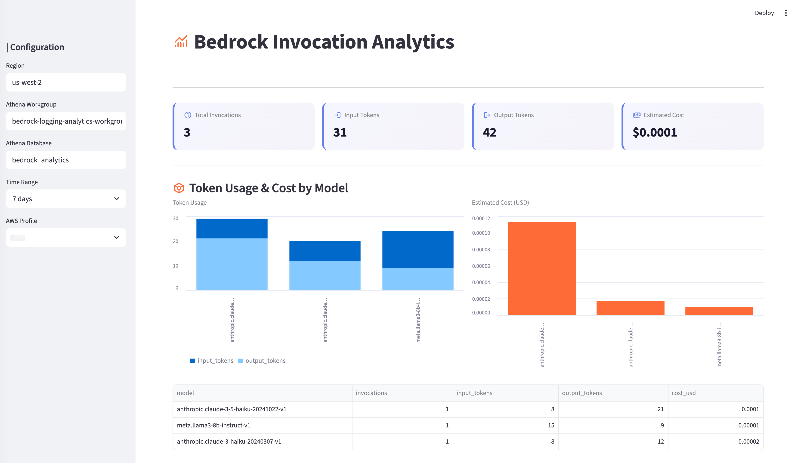

# Bedrock 调用日志分析

[English](../README.md) | 中文

Amazon Bedrock 实时分析 — 监控多账户的 Token 用量、成本和性能。

## 功能
- 概览卡片：调用次数、输入/输出 Token、缓存 Token、预估成本、平均延迟、平均 TPOT
- 按模型和调用者的 Token 用量与成本（图表 / 饼图 / 表格视图），成本按 Token 类型分拆（输入 / 输出 / 缓存读 / 缓存写)
- 性能分析：按模型延迟（min/avg/max）+ 延迟趋势（支持按模型筛选）
- TPOT 分析：按模型 TPOT（min/avg/max）+ CloudWatch TTFT 趋势（avg/p99）
- 使用趋势（支持模型/调用者联动筛选）
- Header 显示 "Data up to"（基于 L2 checkpoint），反映真实数据新鲜度而非 UI 刷新时间
- 自动刷新（10s / 30s / 1min / 5min）
- 时间感知定价：价格变化后历史成本仍然正确；区分 5min 与 1h prompt cache 单价
- 定价设置页面：查看/编辑模型定价及历史，每周从 LiteLLM 自动同步
- Athena 即席查询 Iceberg 事件表，支持深度排查
- 多账户、多区域支持（侧栏选择器,从 `config.yaml` 读取友好账号名）
- 登录认证（通过 `config.yaml` 配置）
- 响应式布局（桌面和移动端）

**截图**



## 项目结构

```
├── deploy/
│   ├── cdk.json              # CDK 配置
│   ├── app.py                # CDK 应用入口（hub/spoke 路由）
│   ├── hub_stack.py          # 主账号 Stack
│   ├── spoke_stack.py        # Spoke 账号 Stack
│   └── lambda/
│       ├── parse_log.py      # L1：S3 事件 → 规整 JSON → Firehose
│       ├── compute_cost.py   # L2：Athena (Iceberg) → 定价 → DynamoDB
│       ├── aggregate_stats.py # 汇总：HOURLY → DAILY → MONTHLY
│       ├── sync_pricing.py   # 每周从 LiteLLM 同步定价
│       └── process_log.py    #（旧 V2 路径,保留备查）
├── webui/
│   ├── main.py               # 入口（ui.run）
│   ├── dashboard.py          # 仪表盘页面
│   ├── pricing.py            # 定价设置页面
│   └── data.py               # DynamoDB 数据访问层
├── scripts/
│   └── seed_pricing.py       # 从 LiteLLM 导入定价
├── config.example.yaml       # 多账号部署配置
├── deploy.sh                 # CDK 部署脚本（hub/spoke/all/destroy）
├── start-webui.sh            # WebUI 启动脚本（读取 .env.deploy）
└── pyproject.toml            # 依赖管理（uv）
```

## 架构

两阶段管道：**L1**（解析）把每次 Bedrock 调用转成结构化事件写入 Iceberg 表;**L2**（计算）按定价汇总这些事件到 DynamoDB 供仪表盘读取。

```
┌──────────────────────────────────────────────────────────────────────────────┐
│ 主账号（Hub）                                                                  │
│                                                                              │
│  S3 日志 ──→ EventBridge ──→ Lambda: parse_log ──→ Firehose ──→ S3 Tables    │
│  (Bedrock)                   [L1：仅规整]         (60s 缓冲)    (Iceberg)    │
│                                                           │                  │
│                                  ┌────────────────────────┤                  │
│                                  │                        │                  │
│                                  ▼ 每 5 分钟              │                  │
│                    Lambda: compute_cost                   │                  │
│                    [L2：定价 + 聚合]                      │                  │
│                          │                                │                  │
│                          ▼                                ▼                  │
│                    DynamoDB: usage-stats          Athena：即席查询           │
│                    （UI 的 serving 缓存层）       （通过 Glue 联邦）          │
│                          │                                                   │
│                          ▼                                                   │
│                         WebUI                                                │
│                                                                              │
│  DynamoDB: model-pricing ◄── Lambda: sync_pricing（每周）                     │
│  Lambda: aggregate_stats（HOURLY → DAILY → MONTHLY,每日/每月触发）           │
│  IAM Role: SpokeWriteRole（供 spoke assume 后写入 Hub Firehose）              │
└──────────────────────────────────────────────────────────────────────────────┘
       ▲ assume role + 跨账号 firehose:PutRecord
       │
┌──────┴───────────────────────────────────────────────────────────────────────┐
│ Spoke 账号                                                                   │
│                                                                              │
│  S3 日志 ──→ EventBridge ──→ Lambda: parse_log ──→ Hub Firehose              │
│  (Bedrock)                                                                   │
└──────────────────────────────────────────────────────────────────────────────┘
```

**工作原理：**

1. **Bedrock 日志** 落到各账号自己的 S3 桶（Bedrock 要求日志汇流桶与调用在同账号同 Region）。
2. **L1 `parse_log`**（每个账号一个 Lambda,由 S3 事件触发）把每条记录规整成扁平 JSON 事件（account、region、model、caller、token 数、缓存拆分、延迟、错误码）,通过 `PutRecordBatch` 投递到 Hub 的 Firehose。Spoke Lambda 通过跨账号角色访问。
3. **Firehose → S3 Tables**：Firehose 缓冲约 60 秒后,以 `request_id` 为唯一键 upsert 到 Iceberg 表 `bedrock_analytics.usage_events` —— 这是每次 Bedrock 调用的**真实数据源**,同时可直接通过 Athena 即席查询做深度分析。
4. **L2 `compute_cost`**（仅 Hub,EventBridge 每 5 分钟触发）通过 Athena 读取 Iceberg 新事件,在 DynamoDB 中查询时间感知定价,计算成本（拆分 5min 与 1h prompt cache）,并以 `TransactWriteItems` + 去重守护的方式聚合到 DynamoDB。解析和计算分离意味着修复定价 bug 或调整聚合逻辑时,只需对历史事件重跑 L2,无需重新解析原始 S3。
5. **`aggregate_stats`** 按计划把 hourly → daily → monthly 汇总。**`sync_pricing`** 每周从 [LiteLLM](https://github.com/BerriAI/litellm) 拉最新模型定价。
6. **WebUI** 从 DynamoDB 读取（亚秒级响应）,作为 serving 缓存层。Header 显示基于 L2 checkpoint 的 *"Data up to X"*,让用户能区分真实数据新鲜度和 UI 刷新时间。

## 前置条件

- [AWS CDK CLI](https://docs.aws.amazon.com/cdk/v2/guide/getting-started.html)（`npm install -g aws-cdk`）
- [uv](https://docs.astral.sh/uv/)（Python 包管理器）
- 已配置 AWS 凭证（`aws configure` 或 `~/.aws/credentials`）

## 部署

复制 `config.example.yaml` 为 `config.yaml`,填写 AWS profile、region 和账号名。标记 `primary: true` 的为主账号,部署完整 Hub stack（DynamoDB、Iceberg、Firehose、WebUI）;其他账号部署轻量 Spoke,将事件转发到 Hub。

```bash
# 安装依赖
uv sync

# 部署主账号（自动初始化 CDK）
./deploy.sh hub

# 部署其他账号
./deploy.sh spoke              # 所有 spoke
./deploy.sh spoke lab          # 指定 spoke

# 全部部署（更新代码后推荐使用）
./deploy.sh all
```

> **注意：** 代码更新后，建议使用 `./deploy.sh all` 确保 hub 和 spoke 的 Lambda 同步更新。

> 使用已有存储桶时，需启用 S3 EventBridge 通知：
> ```bash
> aws s3api put-bucket-notification-configuration --bucket 你的桶名 \
>   --notification-configuration '{"EventBridgeConfiguration": {}}'
> ```

### 部署资源

**主账号（Hub）：**

| 资源 | 用途 |
|------|------|
| S3 存储桶（可选） | 原始 Bedrock 调用日志（加密、生命周期） |
| Custom Resource | 配置 Bedrock 调用日志 |
| DynamoDB × 2 | `usage-stats`（serving 层 + DEDUP + META）和 `model-pricing`（时间感知） |
| S3 Tables bucket + namespace + Iceberg 表 | `usage_events` — 真实数据源,通过 Athena 可查 |
| Glue Data Catalog（联邦） | `s3tablescatalog`,指向 S3 Tables bucket |
| Lake Formation 设置 | 将 CDK 部署角色注册为 admin（纯 IAM 模式访问 Iceberg 所需） |
| Firehose 投递流 | S3 Tables 目标,60s 缓冲,以 `request_id` 为 upsert 键 |
| Athena workgroup | 供 `compute_cost` 和即席查询使用 |
| Lambda × 6 | `parse_log`（L1）、`compute_cost`（L2）、`aggregate_stats`、`sync_pricing`、`process_log`（旧路径）、`bedrock-invocation-setup`（Custom Resource 处理器） |
| EventBridge × 5 | S3 触发器、v3 S3 触发器、L2 调度、每日与每月汇总、每周定价同步 |
| IAM Roles | Firehose 投递角色（由 `deploy.sh` 预创建以规避 IAM 传播时延）、Lambda 执行角色、`SpokeWriteRole`（被 spoke 账号信任） |

**Spoke 账号：**

| 资源 | 用途 |
|------|------|
| S3 存储桶（可选） | 原始 Bedrock 日志 |
| Custom Resource | 配置 Bedrock 调用日志 |
| Lambda × 2 | `parse_log`（L1,assume hub role 后调 `firehose:PutRecord`）和 `process_log`（旧路径） |
| EventBridge × 2 | 启用的 v3 S3 触发器和禁用的旧触发器 |
| SQS DLQ | 处理失败的死信队列 |

## 初始化定价数据

定价数据来源于 [LiteLLM](https://github.com/BerriAI/litellm)（覆盖 286+ Bedrock 模型）：

```bash
AWS_DEFAULT_REGION=us-west-2 python3 scripts/seed_pricing.py \
  BedrockInvocationAnalytics-model-pricing YOUR_PROFILE
```

## 启动 WebUI

```bash
./start-webui.sh
```

浏览器打开 http://localhost:8060

## 清理

```bash
./deploy.sh destroy --profile YOUR_PROFILE
```

> DynamoDB 表和 S3 存储桶在删除 Stack 后会保留（RemovalPolicy: RETAIN）。

## 成本

| 服务 | 定价 | 说明 |
|------|------|------|
| Lambda | $0.20/百万次请求（ARM/Graviton） | L1 parse_log + L2 compute_cost + 汇总 |
| Firehose | $0.029/GB 摄入 + 少量每记录费用 | 缓冲后 upsert 到 Iceberg |
| S3 Tables (Iceberg) | 约 $0.023/GB + $0.20/百万次请求 | 按 `account_id / year / month / day` 分区 |
| DynamoDB | 按请求付费 | 只有 L2 聚合写入（较 V2 写入次数减少约 13 倍,L1 不再写 DDB） |
| Athena | $5/TB 扫描 | L2 每次扫描一个分区;即席查询另计 |
| S3（原始日志） | 约 $0.023/GB/月 | 90 天后自动转为低频存储 |

**月度估算**（100 万次 Bedrock 调用,Anthropic 模型含缓存）：
- Lambda：约 $0.20（L1）+ 约 $0.05（L2,每 5 分钟）
- Firehose + S3 Tables：约 $1（几百 MB Iceberg 数据）
- DynamoDB：约 $0.30（L2 TransactWriteItems,每事件约 3 条 items）
- Athena：约 $0.10（L2 扫描小时级小分区;即席查询另计）
- S3（原始日志）：约 $1
- **合计：约 $3/月**

成本对调用次数是亚线性增长 —— Firehose 缓冲摊薄每记录开销,Iceberg 分区裁剪随历史增长仍保持较小扫描量。
