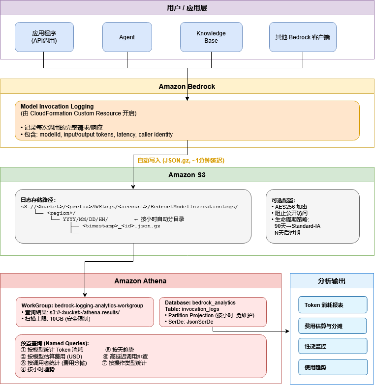

# [IaC] Bedrock 调用日志分析方案

[English](../README.md) | 中文

一键部署 Amazon Bedrock 调用日志记录，通过 Amazon Athena 分析 Token 消耗与费用。

## 架构

```
Bedrock API 调用 → 调用日志 → S3 (JSON.gz) → Athena (SQL 查询)
```



**部署资源：**
- AWS Lambda (自定义资源) — 配置 Bedrock 调用日志
- IAM Role — Lambda 执行角色，具备 Bedrock 日志配置权限
- Athena WorkGroup — 专用工作组，含查询结果位置和 10GB 扫描限制
- Athena Named Queries — 7 个预置分析查询模板
- S3 Bucket (可选) — 含 AES256 加密、公开访问阻止和生命周期策略

## 部署

> **注意：** 请将下方 `aleck31/bedrock-logging-analytics/main` 替换为你的实际 GitHub 仓库路径。

| 区域 | 部署 |
|------|------|
| us-west-2 (俄勒冈) | [](https://us-west-2.console.aws.amazon.com/cloudformation/home?region=us-west-2#/stacks/create/review?stackName=bedrock-logging-analytics&templateURL=https://raw.githubusercontent.com/aleck31/bedrock-logging-analytics/main/cf-deploy-template.yaml) |
| us-east-1 (弗吉尼亚北部) | [](https://us-east-1.console.aws.amazon.com/cloudformation/home?region=us-east-1#/stacks/create/review?stackName=bedrock-logging-analytics&templateURL=https://raw.githubusercontent.com/aleck31/bedrock-logging-analytics/main/cf-deploy-template.yaml) |

## 参数说明

| 参数 | 默认值 | 说明 |
|------|--------|------|
| UseExistingBucket | No | `Yes` 使用已有 S3 存储桶，`No` 创建新桶 |
| ExistingBucketName | — | 选择 Yes 时必填，该桶需允许 Bedrock 执行 `s3:PutObject` |
| LogPrefix | `bedrock/invocation-logs/` | S3 日志前缀 |
| LogRetentionDays | 365 | 日志保留天数（仅新建桶生效） |
| AthenaDbName | `bedrock_analytics` | Athena 数据库名称 |

## 部署后配置

1. 打开 **Athena 控制台**，选择工作组 `bedrock-logging-analytics-workgroup`
2. 进入 **已保存的查询** 标签页
3. 先运行 `bedrock-logging-analytics-create-database`
4. 再运行 `bedrock-logging-analytics-create-table` 创建分区表
5. 开始使用预置的分析查询

## 预置查询

| 查询名称 | 说明 |
|----------|------|
| token-usage-by-model | 按模型统计 Token 消耗和平均延迟（近 7 天） |
| estimated-cost-by-model | 按模型估算费用（近 30 天） |
| usage-by-caller | 按 IAM 用户/角色统计用量，用于费用分摊 |
| hourly-trend | 按小时统计调用和 Token 趋势（近 24 小时） |
| daily-trend | 按天统计调用和 Token 趋势（近 30 天） |
| high-latency-calls | 延迟超过 5 秒的调用（近 7 天） |

## 使用方法

### Athena 控制台查询

1. 打开 [Athena 控制台](https://console.aws.amazon.com/athena/home)
2. 在顶部下拉框选择工作组 `bedrock-logging-analytics-workgroup`
3. 进入 **已保存的查询** 标签页 → 点击任意预置查询 → **运行**
4. 或在 **编辑器** 标签页中编写自定义查询，表名为 `bedrock_analytics.invocation_logs`

### AWS CLI 查询

```bash
# 执行查询
QUERY_ID=$(aws athena start-query-execution \
  --query-string "SELECT modelId, count(*) as cnt, sum(input.inputTokenCount) as input_tokens, sum(output.outputTokenCount) as output_tokens FROM invocation_logs WHERE datehour >= date_format(date_add('day', -7, now()), '%Y/%m/%d/%H') GROUP BY modelId ORDER BY cnt DESC" \
  --query-execution-context Database=bedrock_analytics \
  --work-group bedrock-logging-analytics-workgroup \
  --region us-west-2 \
  --query 'QueryExecutionId' --output text)

# 等待完成
aws athena get-query-execution --query-execution-id $QUERY_ID \
  --region us-west-2 --query 'QueryExecution.Status.State' --output text

# 获取结果
aws athena get-query-results --query-execution-id $QUERY_ID \
  --region us-west-2 --output table
```

### Python (boto3) 查询

```python
import boto3, time

athena = boto3.client('athena', region_name='us-west-2')

resp = athena.start_query_execution(
    QueryString="""
        SELECT modelId, count(*) as invocations,
               sum(input.inputTokenCount) as input_tokens,
               sum(output.outputTokenCount) as output_tokens
        FROM invocation_logs
        WHERE datehour >= date_format(date_add('day', -7, now()), '%Y/%m/%d/%H')
        GROUP BY modelId
    """,
    QueryExecutionContext={'Database': 'bedrock_analytics'},
    WorkGroup='bedrock-logging-analytics-workgroup'
)

query_id = resp['QueryExecutionId']

# 等待查询完成
while True:
    status = athena.get_query_execution(QueryExecutionId=query_id)
    state = status['QueryExecution']['Status']['State']
    if state in ('SUCCEEDED', 'FAILED', 'CANCELLED'):
        break
    time.sleep(1)

# 获取结果
results = athena.get_query_results(QueryExecutionId=query_id)
for row in results['ResultSet']['Rows']:
    print([col.get('VarCharValue', '') for col in row['Data']])
```

### 自定义查询提示

查询时务必加上 `datehour` 分区过滤条件，以减少 Athena 扫描量和费用：

```sql
-- 最近 24 小时
WHERE datehour >= date_format(date_add('day', -1, now()), '%Y/%m/%d/%H')

-- 指定日期
WHERE datehour >= '2026/03/17/00' AND datehour <= '2026/03/17/23'

-- 最近 7 天
WHERE datehour >= date_format(date_add('day', -7, now()), '%Y/%m/%d/%H')
```

## CLI 部署

```bash
# 创建新桶
aws cloudformation create-stack \
  --stack-name bedrock-logging-analytics \
  --template-body file://cf-deploy-template.yaml \
  --parameters ParameterKey=UseExistingBucket,ParameterValue=No \
  --capabilities CAPABILITY_IAM \
  --region us-west-2

# 使用已有桶
aws cloudformation create-stack \
  --stack-name bedrock-logging-analytics \
  --template-body file://cf-deploy-template.yaml \
  --parameters ParameterKey=UseExistingBucket,ParameterValue=Yes \
               ParameterKey=ExistingBucketName,ParameterValue=你的桶名 \
  --capabilities CAPABILITY_IAM \
  --region us-west-2
```

## 清理

```bash
aws cloudformation delete-stack --stack-name bedrock-logging-analytics --region us-west-2
```

> 删除堆栈会关闭 Bedrock 调用日志。如果创建了新的 S3 桶，该桶会被保留（DeletionPolicy: Retain），需手动删除。

## 费用

本方案涉及三项 AWS 服务费用：

| 服务 | 定价 | 说明 |
|------|------|------|
| S3 存储 | ~$0.023/GB/月 (Standard) | 90 天后自动转为 Standard-IA ($0.0125/GB) |
| Athena | $5/TB 扫描量 | 分区投影可大幅减少扫描量 |
| Lambda | $0.20/百万次请求 | 仅在堆栈创建/更新/删除时调用 |

**月度费用估算**（假设每次调用日志压缩后平均 ~1KB）：

| 月调用量 | S3 存储 | Athena (每天10次查询) | 预估总费用 |
|--------:|---------:|---------------------:|-----------:|
| 1 万次 | < $0.01 | < $0.01 | < $0.05 |
| 10 万次 | ~$0.01 | ~$0.05 | ~$0.10 |
| 100 万次 | ~$0.10 | ~$0.50 | ~$0.70 |
| 1000 万次 | ~$1.00 | ~$5.00 | ~$7.00 |

> - S3 存储为累积量（每月增长，直到生命周期策略过期删除）
> - Athena 费用取决于查询频率和时间范围 — 查询时务必使用 `datehour` 分区过滤以减少扫描量
> - 实际日志大小与 prompt/response 长度相关，长对话场景下平均可能达到 5-10KB+/次
